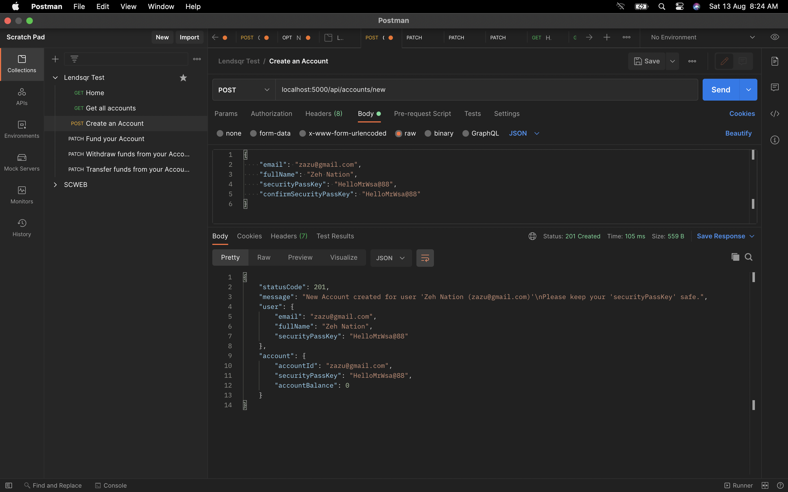

<div align="center">
  <h3 align="center">Lending Job Assessment</h3>

  <p align="center">
    An awesome Account API
    <br />
    <a href="https://lends.herokuapp.com">View Demo</a>
  </p>
</div>


<!-- TABLE OF CONTENTS -->
<details>
  <summary>Table of Contents</summary>
  <ol>
    <li>
      <a href="#about-the-project">About The Project</a>
      <ul>
        <li><a href="#endpoints">API Endpoints</a></li>
        <li><a href="#built-with">Built With</a></li>
      </ul>
    </li>
    <li>
      <a href="#getting-started">Getting Started</a>
      <ul>
        <li><a href="#prerequisites">Prerequisites</a></li>
        <li><a href="#installation">Installation</a></li>
      </ul>
    </li>
    <li><a href="#usage">Usage</a></li>
    <li><a href="#license">License</a></li>
  </ol>
</details>


<!-- ABOUT THE PROJECT -->
## About The Project
A Backend RESTFUL API that satisfy the following requirements:

### Given requirements 
* A user can create an account
* A user can fund their account
* A user can transfer funds to another user’s account
* A user can withdraw funds from their account.

### Built With
* ExpressJS
* TypeScript
* NodeJS
* KnexJS
* MySQL
* GitHub Actions
* Postman


  
### Endpoints:

#### Get all accounts on the app
`GET /api/accounts`

#### Create an account

`POST /api/accounts/new`

Example request body:

```source-json
{
    "email": "zazu@gmail.com",
    "fullName": "Zeh Nation",
    "securityPassKey": "HelloMrWsa@88",
    "confirmSecurityPassKey": "HelloMrWsa@88"
}
```

Required fields: `email`, `fullName`, `securityPassKey`, `confirmSecurityPassKey`

#### Fund an account

`PATCH /api/accounts/fund`

Example request body:

```source-json
{
    "email": "zazu@gmail.com",
    "securityPassKey": "HelloMrWsa@88",
    "amount": 9000
}
```

Required fields: `email`, `securityPassKey`, `amount`

#### Withdraw funds from an account

`PATCH /api/accounts/withdraw`

Example request body:

```source-json
{
    "email": "zazu@gmail.com",
    "securityPassKey": "HelloMrWsa@88",
    "amount": 90
}
```

Required fields: `email`, `securityPassKey`, `amount`

#### Transfer funds between accounts

`PATCH /api/accounts/transfer`

Example request body:

```source-json
{
    "receipient": "far@gmail.com",
    "sender": "zazu@gmail.com",
    "securityPassKey": "HelloMrWsa@88",
    "amount": 48
}
```

Required fields: `receipient`, `sender`, `securityPassKey`, `amount`


### HTTP Response Status codes:

* 200 for OK
* 201 for new content successfully added
* 400 for Bad requests
* 404 for Not found requests, when a resource can't be found to fulfill the request
* 409 for conflicting requests
* 500 for Internal Server Error

<p align="right">(<a href="#readme-top">back to top</a>)</p>


<!-- GETTING STARTED -->
## Getting Started

### Prerequisites

* First step in setting up the app is to ensure that NodeJS & NPM are installed on your computer. To check if it is installed on your computer, run the following command.
    ```
      node -v  // Outputs the NodeJS version on your computer e.g v14.15.4
      npm -v  // Outputs the NPM version on your computer e.g v6.14.10
    ```

    ```
      node -v  // Outputs command not found: node if it isn't installed on your computer
      npm -v  // Outputs command not found: npm if it isn't installed on your computer
    ```

* If it isn't installed yet,
  Visit the [NodeJS site]('http://nodejs.org') or google search for instructions on how to install NodeJS & NPM on your computer OS.

* Next, you need to have MySQL installed on your machine too or you could connect to an external MySQL DB Service provider.

### Installation

1. Clone the repo
   ```sh
   git clone https://github.com/rafmme/lend-test.git
   ```
2. Install NPM packages
   ```sh
   npm install
   ```
3. Rename the `.env.example` file to `.env` and populate the variables with the right data
   ```
   DB_DATABASE="your_db_name"
   TEST_DATABASE="your_test_db_name"
   DB_USER="db_user"
   DB_PASSWORD="db_password"
   DB_HOST="127.0.0.1"
   DB_PORT=3306
   PORT=5000
   CLEARDB_DATABASE_URL="mysql://localhost:3306/db_name"
   ```

4. Run this command ```npm start``` or ```npm run dev``` to start up the application.

5. To run the written tests for the app, run command ```npm test```

<p align="right">(<a href="#readme-top">back to top</a>)</p>


<!-- USAGE EXAMPLES -->
## Usage

<div style="text-align:center">
    
</div>

<p align="right">(<a href="#readme-top">back to top</a>)</p>

<!-- LICENSE -->
## License

Distributed under the MIT License. See `LICENSE.txt` for more information.

<p align="right">(<a href="#readme-top">back to top</a>)</p>

